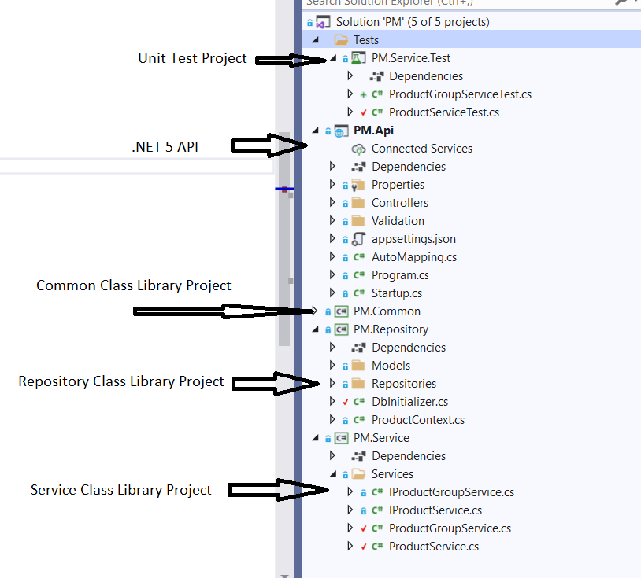
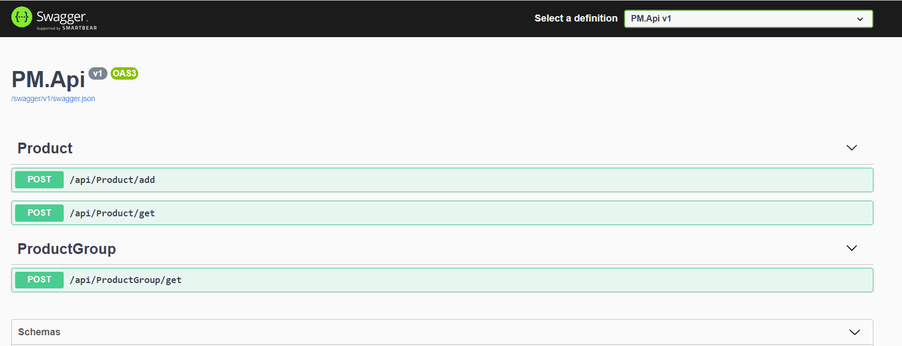

# Product Management
It is an API project for managing products in the store.

## Tools and technologies
Visual Studio 2019, .NET 5 API, Entity Framework Core 5, AutoMapper, FluentValidation, NUnit and Moq.

## Project Structure

## Data Store
MsSqllocaldb was used for storing data. Some basic seed data was added using entity framework. 
A class called "DbInitializer" was used where code for inserting seed data is present.

## How to run
Open the solution using visual studio 19 and run.

## API description
There are three API endpoints:

1. api/Product/get, To get the product(s) by-product id, if product id is not given all products will show.

2. api/Product/add, To add a product, all validation is checked before adding a new product.

3. api/ProductGroup/get, To get product group(s) by-product group id, if id not given all groups will show with individual subgroups in a tree view.

## API View 

## Postman
A postman collection is included to call the APIs.

A json script is added in this [a link] (https://github.com/saydunnesa-shirin/PM/blob/main/docs/Postman/PM.postman_collection.json) link.